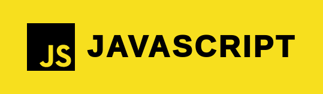
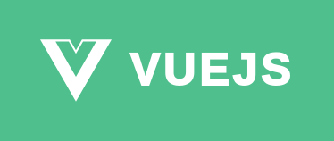
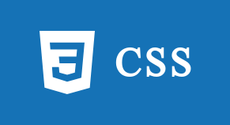
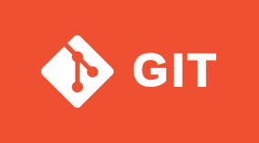
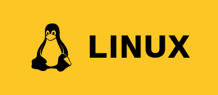
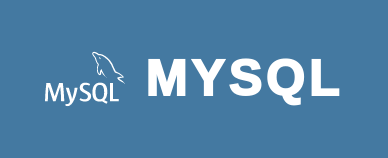
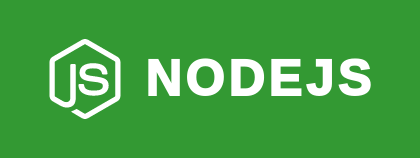
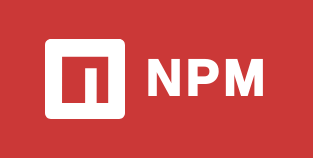
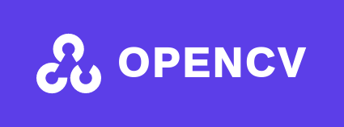

<section align="center">

<h1 align="center">Hi 👋, I am Yehya Usman</h1>
<h3 align="center">Passionate Self Taught Developer From India</h3>
</section>

<section>
<h3>🧰 Tools And Technologies</h3>
 

</section>